<h2 align="left">Hi 👋! I'm Ahmed Mostafa</h2>

  Senior Computer Science student majoring in <b>Software Engineering</b> at Misr International University (Class of 2027).  
  I have hands-on experience across <b>Full-Stack Web Development, Android, DevOps, Software Testing, and Security</b>.  
  I’ve completed internships at <b>NBE, ITIDA, and Fuzetek</b>, built a <b>deployment & automation toolkit</b>, delivered real-world projects like <b>Vaultique</b> and <b>Cybertopia</b>, and led the development of the <b>MSP-MIU website</b>.  
  I’m currently seeking <b>junior roles</b> focused on <b>secure, scalable systems, automation, and CI/CD</b>.

---

<h2 align="left">GitHub Stats 📈</h2>

  
  
   
  

 

<h2 align="left">Tools & Technologies 🛠️</h2>

  <!-- Frontend & Backend -->
  
  
  
  
  
  
  
  
  
  <!-- Databases -->
  
  
  

  <!-- DevOps & OS -->
  
  
  

  <!-- Mobile & Languages -->
  
  
  
  
  

  <!-- Testing & Tools -->
  
  

---

<h2 align="left">Contact Me 👥</h2>

  
  

---

 

